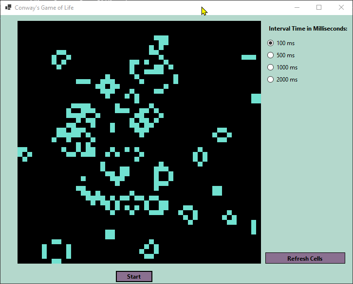

# Conways-Game-Of-Life

Play out the classic Conways Game of Life simulation with this C# application!

## What is CGOL
This is a grid-based simulation. Each cell represents a "living creature".

If a living cell has more than three neighbors, it dies (overpopulation).
If a living cell has less than two neighors, it dies (underpopulation).
If a living cell has 2 to 3 neighbors, it lives.

If an empty cell has three live neighbors, it becomes alive (reproduction).

## Features
* Control the speed of the simulation. Time intervals range from:
  * 1/10 a second (fastest).
  * 1/2 a second.
  * 1 second.
  * 2 seconds (slowest)
* Refresh entire screen to start over.
* Pause and start the simulation
